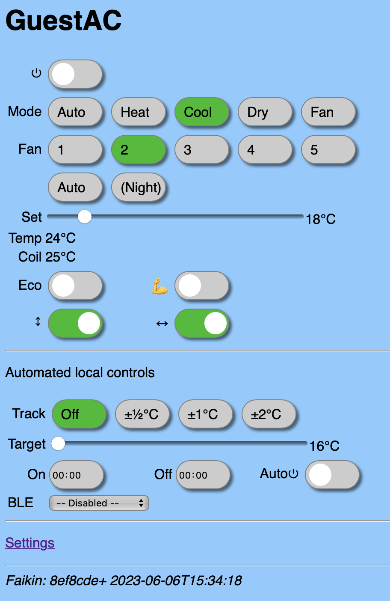

# Web controls

The web controls can be accesses using the name that has been set, we'll use `GuestAC` as an example. So visit `GuestAC.local` as a web page.

Example

## Main operation

The first section coverrs teh direct controls and status for the air-con unit. the exact options depends on the units and settings.

Making changes has immediate effect, and changes by other means, such as IR remote, show immediately (within seconds).

The one exception is the fan "Night" mode, where available. This can be set but it seems there is no way to tell it has been set, so this only shows if set from this interface.

## Automated controls

The automated controls allow a separate layer of controls to be applied. These work by setting "Cool" and "Heat" as needed to achieve a desired temperature, much like the air-con's own "Auto" mode. But with more options.

The "Track" setting, if not "Off", enables the auto setting of *heat* and *cool* modes to aim for a target within a range.

The "Target" is the target temperature. You will see the "Set" in the main controls change to be many degrees below or above the target at various times to *aim* for the target.

The "On"/"Off" times can be set. If not `00:00` (midnight) then they cause the air-con to turn on, or off, at the time specified. Note, you may need to ensure the correct timezone in *settings*. Each is disabled by setting `00:00` (midnight) or setting both to the same time.

The "Auto⏻" control enables automatic *on*/*off* based on temperature. If well outside target range and off, it turns on. When inside range for a time when on, it turns off.