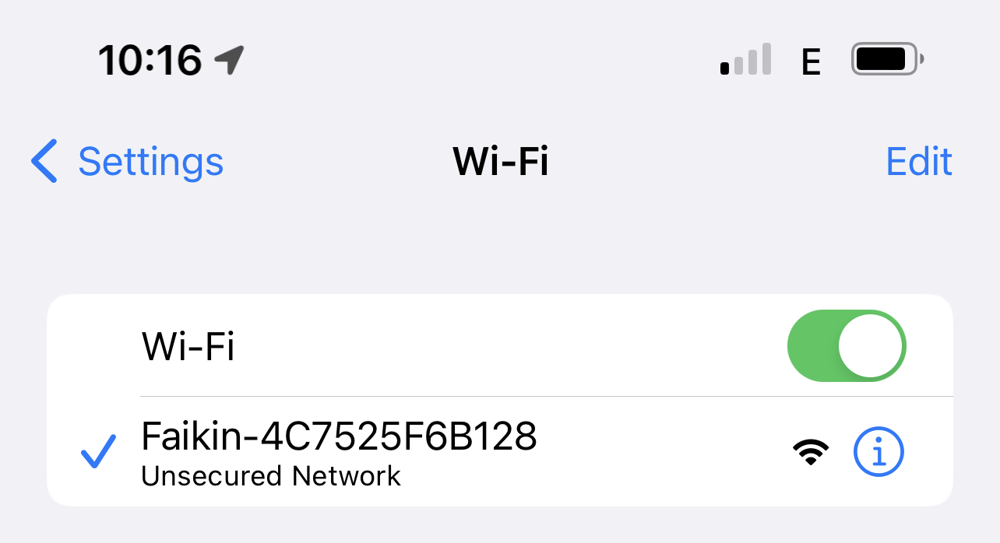

# Faikin - set-up

The *Faikin* is a small circuit board that can replace the common Daikin air-con control WiFi modules.

- Local web control over WiFi, no cloud/account needed, no Internet needed
- MQTT control and reporting
- Integration with Home Assistant using MQTT

## Installation

The latest boards have the 5 pin connector to match the plug for the official Daikin WiFi modules. Simply plug in.

However, you do need a lead, and Daikin charge a lot for these. Typically it will be an S21 lead. However customers have reported simple header wires (i.e. wires with sockets on each wire intended to go on 0.1" pitch headers) work just as well. You need to locate the GND, Power, Tx, and Rx pins on the S21 connector and connect appropriately as marked on the PCB. The board is designed to handle 4V to 40V power, and the air-con typically provides 12V.

A 3D prinabale case design is included on GitHub.

## LED

There is an LED on the module. It is possible to disable it with a setting, e.g. `setting/GuestAC {"blink":[0,0,0]}`. Otherwise it blinks a colour.

If `dark` is set, then only loopback or offline show, otherwise the LED is off.

|Colour|Meaning|
|----|-----|
|Green solid|Startup (first few seconds)|
|Red|Heating (heat or auto mode)|
|Blue|Cooling (cool or auto mode)|
|Orange|Fan mode|
|Cyan|Dry mode|
|Yellow|Power off|
|Magenta|Daikin is offline|
|Red/Green/Blue|Loopback test|
|White|Rebooting|
|White/Red|No wifi config|
|White/Blue|AP+sta mode|
|White/Cyan|AP mode|
|White/Magenta|No wifi on|
|White/Yellow|Link down|

Note that the loopback is useful for testing, a simple link from Tx to Rx will set loopback and flash LED in a repeating sequence red, green, blue, testing the Tx, Rx, and LED are all working as expected.

## WiFi set up

One installed, the LED should light up and blink.

Look for a WiF Access Point called Daikin (or Faikin), e.g.


Select this and it should connect, needing no password.



On an iPhone this should automatically open a web page. On other devices you may need to check the IP settings and enter the *router IP* in to your browser. The page looks like this.


Enter details and press **Set**. Setting a *Hostname* is a good idea so you can name your air-con. For HomeAssistant you will probably need an MQTT username and password. If not in the UK, please look up the *timezone* string needed in the link provided.

### Hostname

Pick a simple one work hostname to describe your air-con, e.g. GuestAC.

### SSID/Password

Enter the details for your own WiFi. You will note a list of SSIDs that have been seen are shown - you can click on one to set the SSID to save typing it. Make sure you enter the passphrase carefully. If the device is unable to connect the page should show an error and allow you to put in settings again. Only 2.4GHz WiFi is supported, and some special characters in SSID may not be supported.

### MQTT

If using MQTT, which could be Home Assistant running MQTT, enter the hostname or IP address of the MQTT server.

In addition you will usually see the option for an MQTT *username* and *password* - these are usually needed if using Home Assistant MQTT server. You can add a user on Home Assistant and then enter the details here.

## Accessing controls

One set up, the device connects to your WIFi. From the same WiFi you should be able to access from a web browser using the hostanme you have picked followed by `.local`, e.g. `GuestAC.local`.

The controls page shows teh controls for your air-con, and also has a link for *WiFi settings* allowing you to change the WiFi and MQTT settings if needed.

# Software Upgrade

We recommend you upgrade the software when you receive the device, as new features are often added.

Go to the web page, and select *WiFi settings*. You can click on *Upgrade*. This does need internet access.

## Re-flash Firmware

If you've forgotten your login credentials or, for some reason, you are denied access to the settings page, you will need to reflash your device.

### Prerequisites:

- A USB to serial converter (such as this one:  or ).
- Some Dupont wires.
- Download the correct firmware binaries for your device (PICO, S1, S2, or S3) from this .
- Note that newer boards may need a TC2030 lead for USB instead

### Connection
Connect the USB to serial converter according to this pinout diagram::


### Erase Flash
Run the following command in the shell::

``` 
esptool.py --chip esp32s3 erase_flash
```

### Flash the New Firmware
Run the following command in the shell (for S3 chip):

```
esptool.py -p /dev/cu.usbserial-A50285BI write_flash 0x0 Faikin-S3-MINI-N4-R2-bootloader.bin 0x8000 partition-table.bin 0xd000 ota_data_initial.bin 0x10000 Faikin-S3-MINI-N4-R2.bin
```

or (for S1 chip)

```
esptool.py -p /dev/ttyUSB0 write_flash 0x1000 Faikin-S1-PICO-bootloader.bin 0x8000 partition-table.bin 0xd000 ota_data_initial.bin 0x10000 Faikin-S1-PICO.bin
```

or (for S2 chip)

```
esptool.py --chip esp32s2 -p /dev/ttyUSB0 write_flash 0x0 Faikin-S2.bin
```

